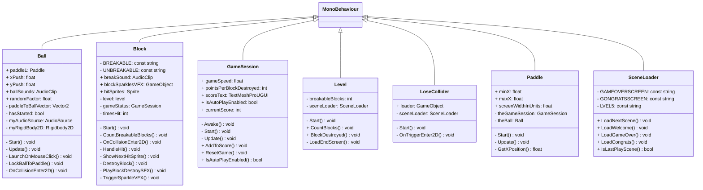

# 02-DebugBlockbreaker-cdoll

In diesem Spiel kann, ist es das Ziel, die schwebenden Bloecke in der Luft zu zerstören. Die blocke zerstören sich, wenn der Ball einmal ankommt. Der Ball reflektiert an Wand und Decke. Man hat einen kleinen waagerechten Boden und kan diesen über dem sonst offenen Boden hin- und her schieben um zu verhindern, dass der Ball runterfällt. Wenn der Ball runterfällt hat man verloren und es gibt insgesamt 5 Level.

